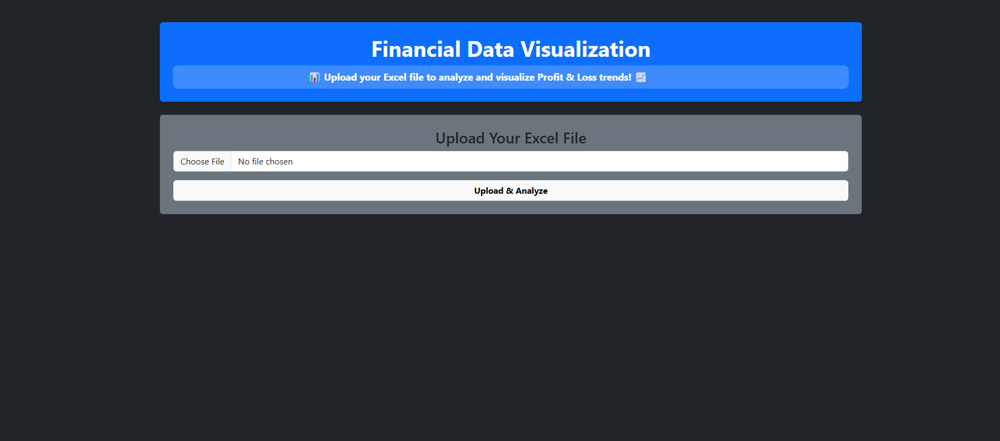
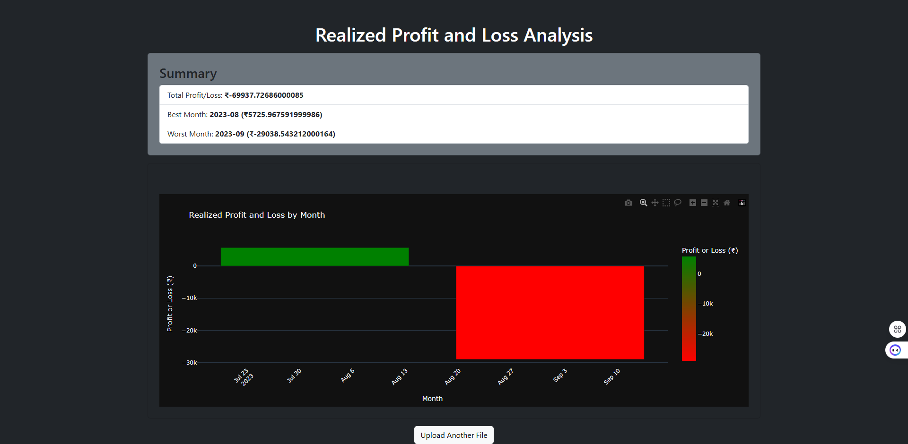

# 📊 Financial Data Visualization App

🚀 A Flask-based web application that allows users to **upload Excel files** and generate **interactive Profit & Loss visualizations** using Plotly.

## 🌟 Features
- 📂 **Upload Excel files** with financial transaction data.
- 📈 **Interactive Profit & Loss Charts** (Zoom, Hover, Save as Image).
- 🎨 **Modern UI** with Bootstrap & smooth scrolling header.
- 🖥️ **Responsive Design** for desktop & mobile users.
- 🚀 **Lightweight & Ready for Deployment**.

---

## 🖥️ Live Demo
🔗 [**View the Live App Here**](#) *(Replace this with your deployed app link)*  

---

## 🛠️ Tech Stack
- **Backend:** Flask, Pandas  
- **Frontend:** HTML, CSS (Bootstrap)  
- **Visualization:** Plotly (Interactive Charts)  
- **File Processing:** OpenPyxl  

---

## 📥 Installation & Usage

### 1️⃣ Clone the Repository
```bash
git clone https://github.com/Amit-Chandra/Financial-Data-Visualization.git
cd financial-visualization-app
```

### 2️⃣ Install Dependencies
```bash
pip install -r requirements.txt
```

### 3️⃣ Run the Flask App
```bash
python app.py
```
The app will be available at `http://127.0.0.1:5000/`

---

## 🖼️ Screenshots
📌 **Upload Page**  


📌 **Plotly Visualization (Interactive Graphs)**  


---

## 📜 Project Structure
```
📂 financial-visualization-app
 ├── 📜 app.py              # Main Flask App
 ├── 📜 requirements.txt    # Dependencies
 ├── 📂 templates/          # HTML Templates
 │   ├── 📜 upload.html
 │   ├── 📜 plot.html
 ├── 📂 static/             # CSS/JS (if needed)
 ├── 📜 README.md           # Project Documentation
```

---

## 🎯 How It Works
1️⃣ **Upload an Excel file** with financial transactions.  
2️⃣ The app **processes the data** and calculates **profit/loss per month**.  
3️⃣ The results are displayed in **interactive Plotly charts** (zoom, hover, etc.).  

---

## 📢 Contribute
Got ideas or improvements? Feel free to fork this repository, submit a pull request, or report issues.  

---

## 🔗 Connect with Me
- **Dev**: [Connect With Me On Dev](https://dev.to/amitchandra/)
- **LinkedIn**: [Connect With Me On LinkedIn](https://www.linkedin.com/in/connect-amit-chandra/)
- **Twitter**: [Connect With Me On X](https://x.com/CodeByAmit)

**⭐ If you found this project helpful, consider giving it a star!** 🌟
```

